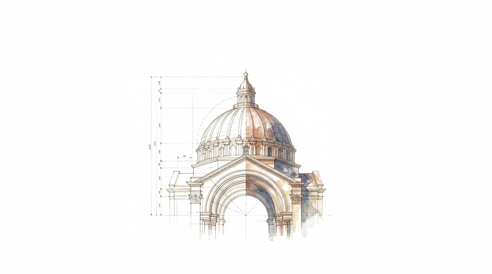

# Renaissance Architect Academy

<p align="center">
  
</p>

<p align="center">
  <em>Where Science Builds Civilization</em>
</p>

---

## About

**Renaissance Architect Academy** is an educational city-building game where students solve architectural challenges across 13+ sciences. Inspired by Leonardo da Vinci's notebooks, the game features a unique watercolor + blueprint aesthetic that brings the Renaissance era to life.

Build iconic structures from Ancient Rome and the Renaissance period while mastering mathematics, physics, engineering, and more!

## Features

- **6 Historic Buildings** - Construct aqueducts, colosseums, Roman baths, duomos, observatories, and workshops
- **13 Sciences** - Master mathematics, physics, chemistry, geometry, engineering, astronomy, biology, geology, optics, hydraulics, acoustics, materials science, and architecture
- **Leonardo's Notebook Aesthetic** - Hand-drawn engineering style with watercolor touches
- **Educational Challenges** - Learn real architectural and scientific principles
- **Progress Tracking** - Track mastery levels from Apprentice to Master

## Screenshots

| Main Menu | City View |
|:---------:|:---------:|
| Engineering-style buttons | Blueprint grid cards |

## Tech Stack

- **SwiftUI** - iOS 17+ / macOS 14+
- **Swift 5.0+**
- **Xcode** - Multiplatform (iPad + macOS)
- **SPM Packages:**
  - Vortex 1.0.4 (particle effects)
  - Pow 1.0.5 (animations)
  - Subsonic 0.2.0 (audio)
- **Midjourney AI** - Art generation (style ref: `--sref 3186415970`)

## Team

| Role | Name |
|------|------|
| **Developer** | Marina Pollak |
| **Level Designer** | [Name] |
| **Game Designer** | [Name] |
| **Game Designer** | [Name] |

## Installation

1. Clone the repository
   ```bash
   git clone https://github.com/GEM-312/RenaissanceArchitectAcademy.git
   ```

2. Open `RenaissanceArchitectAcademy.xcodeproj` in Xcode

3. Select iPad simulator or "My Mac"

4. Press `Cmd+R` to build and run

## Project Structure

```
RenaissanceArchitectAcademy/
├── Views/           # SwiftUI views
├── ViewModels/      # MVVM view models
├── Models/          # Data models
├── Styles/          # Colors, buttons, UI components
├── Services/        # Audio, persistence
├── Fonts/           # Cinzel, EBGaramond, PetitFormalScript
└── Assets.xcassets/ # Images and assets
```

## License

This project is part of Columbia College Chicago - Final Semester (Jan 30 - May 15, 2025)

---

<p align="center">
  Built with SwiftUI
</p>
